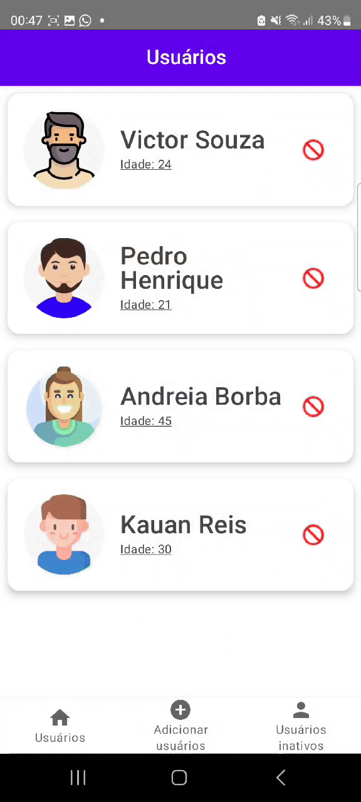

 
  <a href="https://github.com/othneildrew/Best-README-Template">
  <h1 align="center">Hexagon teste técnico - APP Kotlin Jetpack Compose</h1>
  
  
  
  
  

  

 
  
  

  
  

## Conteúdo

* [Sobre o projeto](#about-the-project)
* [Arquitetura](#architecture)
  
## Sobre o projeto
  
Teste técnico da empresa Hexagon mining, utilizando a linguagem Kotlin em conjunto do Jetpack Compose seguindo a arquitetura MVVM.

Este aplicativo inicia na tela de lista de usuários ativos. Nesta tela, é realizado uma consulta ao nosso banco de dados Room, utilizando o Flow para monitorar mudanças em tempo real, como a inativação de usuários, que são então exibidos na tela de usuários inativos.

Na tela inicial, ao selecionar um usuário, um sistema de navegação é acionado para direcionar ao formulário de edição de informações. Nessa tela, é possível editar todos os dados do usuário, incluindo nome, data de nascimento, CPF, cidade e imagem.

É possível também inativar qualquer usuário listado na tela inicial. Uma vez inativado, o usuário é automaticamente transferido para a tela de usuários inativos, processo controlado pela propriedade isActive na tabela de usuários.

A tela de usuários inativos exibe todos os usuários que foram inativados, permitindo reativá-los individualmente através de uma interação com o ícone correspondente. Para garantir uma interação clara, utilizamos um Dialog que solicita confirmação antes de reativar um usuário específico.

Na tela de adicionar usuários, os campos disponíveis permitem definir um novo cadastro como ativo no sistema. Todos esses dados são armazenados localmente no banco de dados do aplicativo.

  ## Arquitetura
MVVM (Model-View-ViewModel) padrão de arquitetura foi usado no desenvolvimento deste aplicativo.

* Arquitetura;
    * [ViewModel](https://developer.android.com/topic/libraries/architecture/viewmodel)
    * [Hilt](https://developer.android.com/training/dependency-injection/hilt-android) 
    * [Navigation](https://developer.android.com/guide/navigation)
    * [Room](https://developer.android.com/jetpack/androidx/releases/room)

## Bibliotecas
 
No desenvolvimento deste aplicativo, optei pelo uso do Room para gerenciar o banco de dados local para persistência de dados. O Room simplifica o trabalho com o SQLite, permite a criação e consulta de dados de maneira mais fluída e segura.

Para a listagem de usuários ativos e inativos, escolhi utilizar o Flow do Kotlin Coroutines. Isso muito importante para implementar atualizações em tempo real na interface do usuário, refletindo mudanças imediatas no banco de dados, como ativação ou inativação de usuários, sem necessidade de recarregar os dados manualmente.

A biblioteca Coil-Compose foi selecionada para o manejo de imagens, desde o upload de uma nova foto na tela de cadastro e edição até a exibição nas listas de usuários.

Utilizei o Hilt para a injeção de dependência, facilitando a gestão de dependências e a escalabilidade do projeto. O Hilt reduz a complexidade do código manual para injeção de dependências e garante uma maior consistência e segurança na construção de componentes do aplicativo.

A navegação no aplicativo foi implementada com o Navigation Compose, que permite uma gestão fluída e fácil das transições entre telas. A adição de uma bottom navigation contribuiu para uma experiência de usuário mais intuitiva e acessível, especialmente porque o aplicativo possui poucas telas, tornando a navegação direta e agradável.

Para gerenciamento do estado e comunicação entre componentes, utilizei a biblioteca lifecycle. Essas ferramentas me permitiram manter os dados dos usuários atualizados e reativos às interações, garantindo que a UI sempre refletisse o estado mais atual do sistema.

No design dos componentes, decidi utilizar tanto o Material Design 2 quanto o Material Design 3 para aproveitar os melhores elementos de cada versão, criando uma interface mais moderna e adaptável a diferentes dispositivos Android.
    
- [Flow](https://developer.android.com/kotlin/flow) - Os fluxos são criados com base em corrotinas e podem fornecer vários valores.
- [Coroutines](https://github.com/Kotlin/kotlinx.coroutines) - Suporte de biblioteca para corrotinas
  
 
